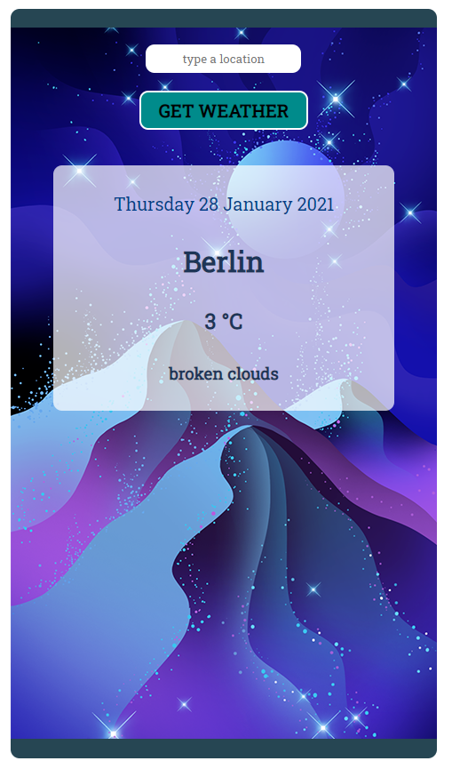
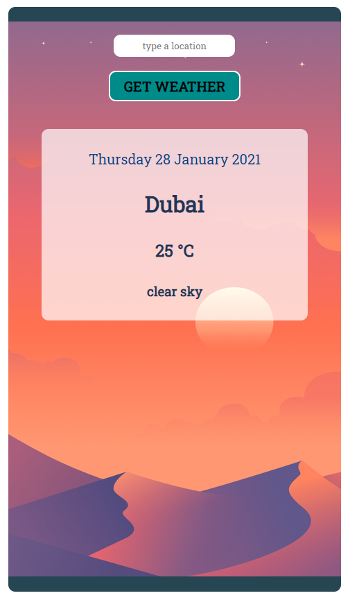

# Weather Data App

#### School of Code Bootcamp - Hackathon Week 7

##### January 2021

_I refactored this app to make it more robust. Changes I made:_

- _I added an error message which appears if the location is not found or if the user has mistyped the location_
- _If the GET WEATHER button is pressed without a location the user is prompted to enter a location_
- _The input box clears itself ready for a new entry once the GET WEATHER button has been pressed_
- _I improved the styling and made the font easier to read on the background image by adding a slightly opaque display box_
- _I got rid of any unnecessary code which was no longer needed_

##### November 2020

_For this one day hackathon our brief was to create a web experience using data from an API. This was our first time working remotely in a group of four - until this point we'd just been working in pairs. In my team we decided to use a weather API to make a weather data app in which you type in any location in the world and get given the current weather for that place._

## Main Learning Points:

- We used Disney Ideation to come up with our idea for the hackathon and worked through the Dreamer, Realist and Critic phases together
- We decided on an MVP which could be achieved by lunchtime and then set some stretch goals which we could work on in the afternoon
- We used Trello to make a Kanban board
- We broke down our idea in component parts ad prioritised our tasks
- We used conditional rendering to only render the Display component to the page if the weather had been set
- We used the ternary operator to toggle the background image between 'cold' and 'warm' depending on the temperature of the location searched - anything about 16ºC was 'warm'
- We made a Date component and wrote a function which formatted the date we got back from the Date Object in the way we wanted it
- We got really good at branching and merging on GitHub!

## Built with:

- HTML
- CSS
- JavaScript
- React

## Getting Started:

Clone the repo as instructed below

## Prerequisites:

Download and install npm modules. Add .env file for local usage. You will need to sign up for a **Current Weather Data** API at https://openweathermap.org/api

## Installation

1.  Clone the repo

`git clone https://github.com/katiehawcutt/weather-forecast-app.git`

2. Install the required npm modules

`npm i`

3. Add a .env file in the root of the folder with the entry:

`REACT_APP_API_KEY= enter you weather api key here`

4. Start the application

`npm start`

## Usage

Type a location into the input and press the GET WEATHER button to be shown the current weather.

In cases where there are more than one place with the same name you may need to type the country too. eg. 'Birmingham' gives you the weather for Birmingham in the USA. To get the weather for Birmingham in the UK type 'Birmingham, UK'
