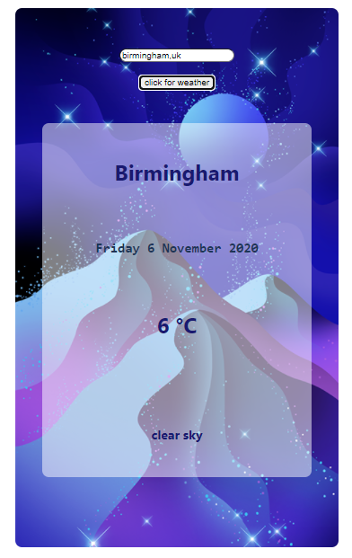
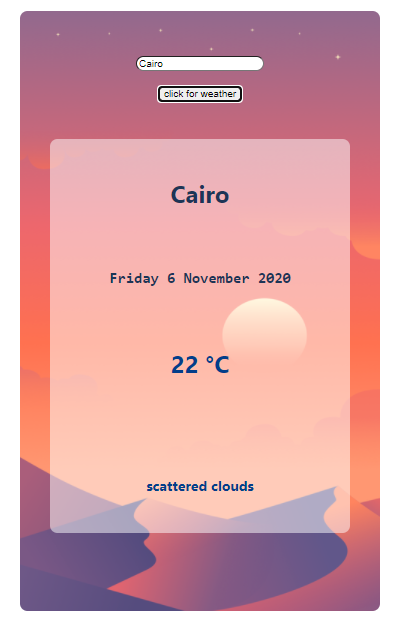

# Weather Forecast App

#### School of Code Bootcamp - Hackathon Week 7

_For this one day hackathon our brief was to create a web experience using data from an API. This was our first time working remotely in a group of four (until this point we'd just been working in pairs). In my team we decided to use a weather API to make a weather forecast app in which you type in the location and get given the current weather._

### Main Learning Points:

- We used Disney Ideation to come up with our idea for the hackathon and worked through the Dreamer, Realist and Critic phases together
- We decided on an MVP which could be achieved by lunchtime and then set some stretch goals which we could work on in the afternoon
- We used Trello to make a Kanban board
- We broke down our idea in component parts ad prioritised our tasks
- We used conditional rendering to only render the Display component to the page if the weather had been set
- We used the ternary operator to toggle the background image between 'cold' and 'warm' depending on the temperature of the location searched - anything about 16ºC was 'warm'
- We made a Date component and wrote a function which formatted the date we got back from the Date Object in the way we wanted it
- We got really good at branching and merging on GitHub!
